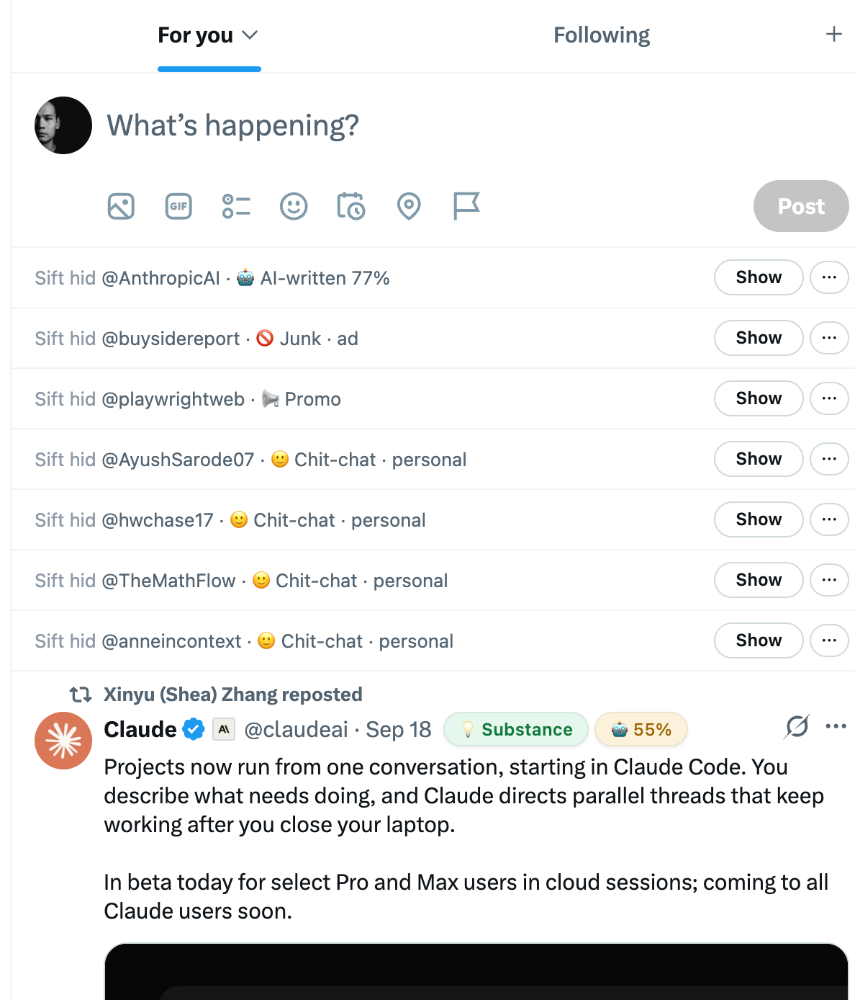
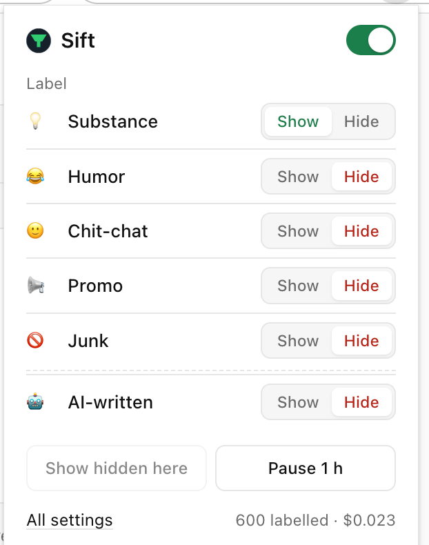

# Sift

Chrome extension. Every post and reply on X gets a label — **Substance · Humor · Chit-chat · Promo · Junk** — plus an AI-written percentage. You choose which labels to hide.

Powered by [TypeSafe Jev](https://typesafe.ai). About $0.00003 per post.

<table>
  <tr>
    <td align="center"></td>
    <td align="center"></td>
  </tr>
  <tr>
    <td align="center">Timeline — hidden posts collapse to one line; each post shows its label and AI-written %</td>
    <td align="center">Popup — flip any label between Show and Hide</td>
  </tr>
</table>

## Install

1. Clone this repo.
2. Open `chrome://extensions`, turn on **Developer mode**, click **Load unpacked**, pick the `sift` folder.
3. The settings page opens. Paste a key from [console.typesafe.ai/keys](https://console.typesafe.ai/keys) and click **Connect**.
4. Open [x.com](https://x.com).

## Use

- Each post shows two pills next to the author: the label, and how likely the text is AI-written.
- Hidden posts collapse to one line. **Show** expands it, **Hide** collapses it again. **⋯** → always show / always hide this account.
- Click the toolbar icon to flip any label between Show and Hide. Takes effect immediately. Default: hide Junk and AI-written.
- Settings: filter replies too, dim instead of collapse, label-only mode, stop phrases (regex, matched locally for free).

## License

MIT
